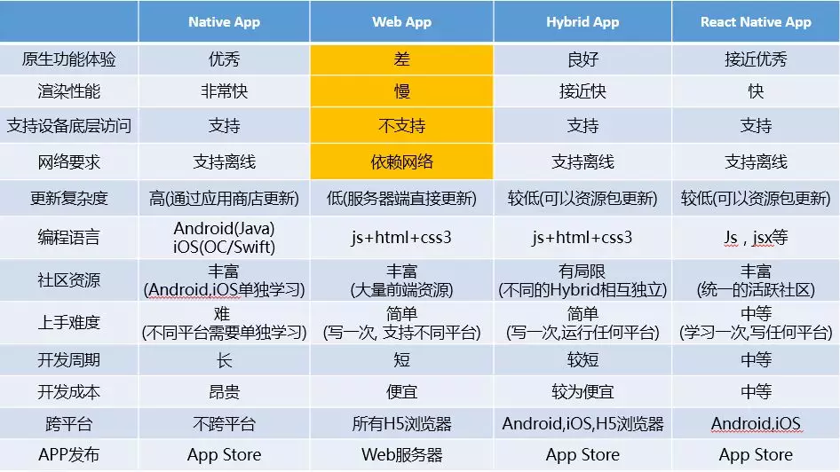
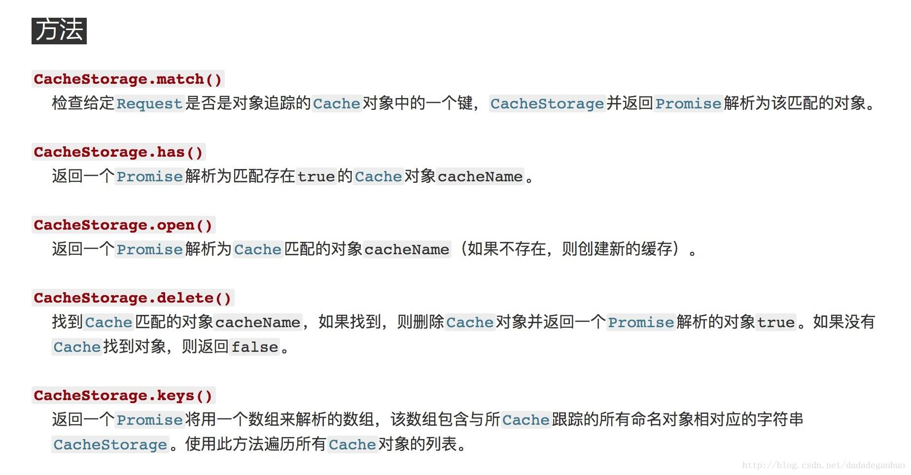
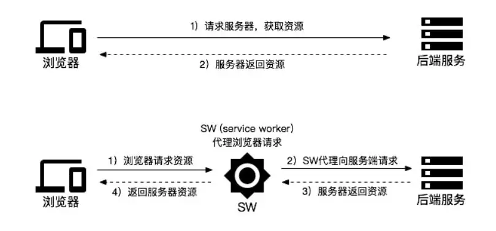
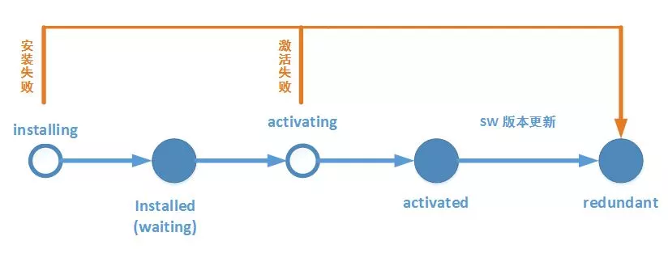
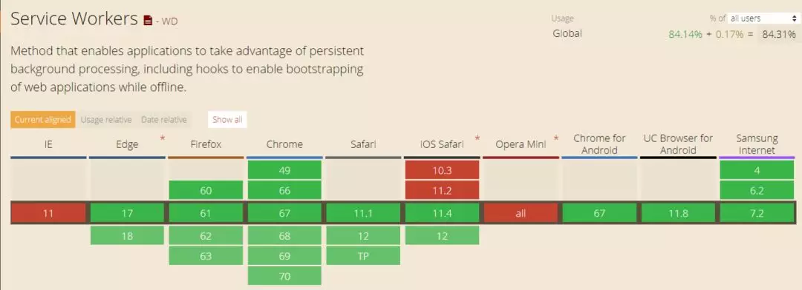

## 什么是PWA
PWA（Progressive Web App）[1]， 渐进式 WEB 应用，是提升 Web App 的体验的一种方法，给用户原生应用的体验。PWA 可以通过 Service Worker， Manifest 等新技术让站点具备离线可用、添加到桌面、实时消息提醒等功能，从功能和体验上无限接近原生 App。

### 背景故事

自1990年万维网之父-蒂莫西·约翰·“蒂姆”·伯纳·李爵士，创建了 HTTP、HTML 和 WorldWideWeb (全世界第一个网页浏览器)以来，Web 技术和影响力在以惊人的速度增长。HTML5，CSS3，Webpack，React，VUE，Babel，SPA 等技术的成熟与发展仿佛让 Web 进入了百家争鸣的春秋时期，Web应用能做的事情越来越多，大家对web的希望也越来越高。

但随着移动时代的到来，web 应用因为不能离线访问，没有快捷入口和页面频繁卡顿等开始失宠。除了原生应用因离线能力，瞬时加载和可靠性强等优点爆炸性崛起外，Hybrid ，React Native 等 APP 开发模式似乎也有点如日中天的“赶脚”。作为一名 Web 前端开发工程师已经瑟瑟发抖，你呢？ 莫慌，老大哥 Google 的工程师们早就“抖”完了，并在2015年提出2016年推出 PWA ，号称 PWA 将成为 Web 颠覆者的契机。


上图中可以看出 webApp在原生功能体验、渲染性能、支持设备底层访问、网络要求在与其他相比下，是不占据优势的。而PWA的到来，一度解决了这些劣势。

### 实现
关于缓存
我们平时用的就是session localstorage CacheStorage等等。
在PWA中使用的就是CacheStorage缓存，他提供了一个ServiceWorker的工作者。

那么，什么是ServiceWorker呢，ServiceWorker其实可以理解为一个调度员。他在浏览器去请求服务器的时候进行拦截，从而形成以下关系。


### service worker的生命周期

正在安装（installing）：发生在 Service Worker 注册之后，表示开始安装，触发 install 事件回调指定一些静态资源进行离线缓存， install 事件回调中有两个方法：
event.waitUntil()：传入一个 Promise 为参数，等到该 Promise 为 resolve 状态为止。
self.skipWaiting()：执行该方法表示强制当前处在 waiting 状态的 Service Worker 进入 activate 状态。

已安装（installed）：安装完成，等待其他的 Service Worker 线程被关闭。

正在激活（activating）：处于 activating 状态期间，Service Worker 脚本中的 activate 事件被执行。我们通常在 activate 事件中，清理 cache 中的文件。 activate 回调中有以下两个方法：
event.waitUntil()：传入一个 Promise 为参数，等到该 Promise 为 resolve 状态为止。
self.clients.claim()：在 activate 事件回调中执行该方法表示取得页面的控制权, 这样之后打开页面都会使用版本更新的缓存。旧的 Service Worker 脚本不再控制着页面，之后会被停止。

已激活（activated）：在这个状态会处理 activate 事件回调 (提供了更新缓存策略的机会)。并可以处理功能性的事件 fetch (请求)、 sync (后台同步)、 push (推送)等。

废弃状态（Redundant）：这个状态表示一个 Service Worker 的生命周期结束。进入废弃 ( redundant ) 状态的原因可能为这几种：
安装 ( install ) 失败
激活 ( activating ) 失败
新版本的 Service Worker 替换了它并成为激活状态

注册 service worker;
``` bash
    if ('serviceWorker' in navigator) {
        navigator.serviceWorker.register(sw.js) // 注册sw.js 文件中变成的服务对象，返回注册成功的对象
        .then(function(swReg){
              swRegistration = swReg;
         }).catch(function(error) {
              console.error('Service Worker Error', error);
         });
    }
```
在sw文件中通过install事件进行静态缓存
``` bash
    let cacheName = 'pwaName';
    self.addEventListener('install',events=>{ #self 表示 service worker 作用域
        events.waitUntil(
            caches.open(cacheName);
        ).then(catch=>catch.addAll([
            'img',
            'js',
            'css'
        ]))
    });
```
通过 fetch 事件使用缓存和处理动态缓存
``` bash
    self.addEventListener('fetch', (e) => {
        // 判断地址是不是需要实时去请求，是就继续发送请求
        if (e.request.url.indexOf('/api/400/200') > -1) {
            e.respondWith(
                caches.open(imgCacheName).then(function(cache){
                     return fetch(e.request).then(function (response){
                        cache.put(e.request.url, response.clone()); //  每请求一次缓存更新一次新加载的图片
                        return response;
                    });
                })
            );
        } else {
            e.respondWith(
                // 匹配到缓存资源，就从缓存中返回数据
                caches.match(e.request).then(function (response) {
                    return response || fetch(e.request);
                })
            );
        }

    });
```
### 兼容性


补充：PWA应用需要在本地的localhost:8080或者127.0.0.1或者https下运行，必须保证页面是安全页面才可以。附上官方教程[https://developers.google.com/web/progressive-web-apps/](https://developers.google.com/web/progressive-web-apps/)
