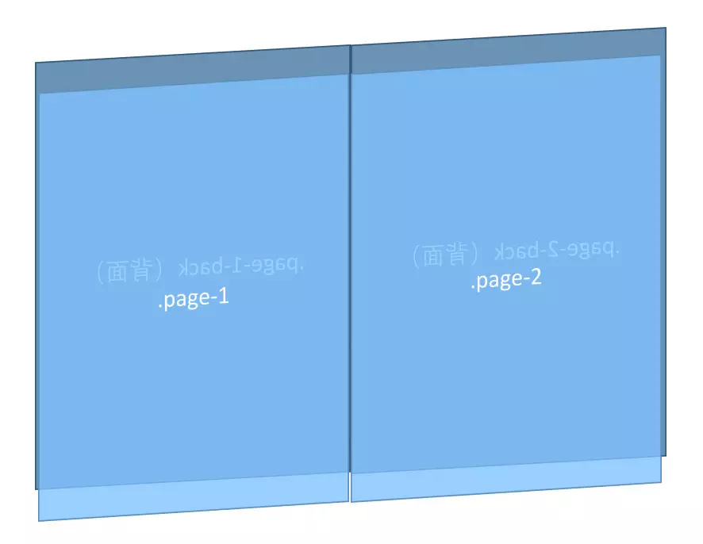

## Css3翻书效果
前言：在掘金上看到一篇人人网的FED的文章。关于Css3翻书效果的。于是自己也尝试了一下。简单的翻书功能已经完成。
直接上代码
Html部分
``` bash
    <ul class="pages">
        <li class="paper" data-left>
            <div class="page page-1-back">
                
            </div>
            <div class="page page-1">
                
            </div>
        </li>
        <li class="paper" data-right>
            <div class="page page-2">
                
            </div>
            <div class="page page-2-back">
                
            </div>
        </li>
        <li class="paper">
            <div class="page page-2">
                
            </div>
            <div class="page page-2-back">
                
            </div>
        </li>
        <li class="paper">
            <div class="page page-2">
                
            </div>
            <div class="page page-2-back">
                
            </div>
        </li>
      </ul>
```
代码中li是每一页，每页都存在正反面。所以都是用的transform属性进行翻转。
``` bash
    .page-1-back,
    .page-2-back {
        transform: scale(-1, 1);
    }
```
这时候还需要注意一下index的层次管理，pape要比pape-back要高所以用z-index属性。
``` bash
    .page-1-back,
    .page-2-back {
        transform: scale(-1, 1);
    }
```
设置完样式后 会行程以下一个样子

其实有几个比较重要的属性。一个是transform-style:preserve-3d; 这个属性使子元素translateZ生效。另外一个就是transform:perspective(); 这个属性有点类似于cavans的相机位置。数值越大就推的越远。

其中学习到了使用css3的一些新属性。以及构建一本书的结构该如何搭建。
下面附上地址[https://github.com/simple-hui/3dbooks](https://github.com/simple-hui/3dbooks)
因为搭建的时候使用的是Vue-cli搭建的，所以clone下来之后需要先进行 npm install之后 再进行npm run dev。就可以访问http://localhost:8000看到效果了。


