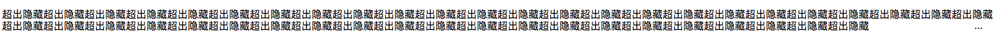
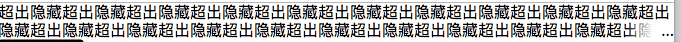

日常肯定会经常碰到文字超级长，展示不下的情况。一般处理都是隐藏超出的文字，显示...

### 单行文字折断 text-overflow
```bash
div {
    white-space: nowrap;
    overflow: hidden;
    text-overflow: ellipsis;
}
```
效果图

以上的属性各大浏览器都支持，兼容性好。但是只能是单行折断。

### -webkit-line-clamp
```bash
div {
    display: -webkit-box;
    overflow: hidden;
    -webkit-line-clamp: 2;
    -webkit-box-orient: vertical;
}
```
效果图

优点：
1、不论多宽都可以达到响应式的截断。
2、只有超出的时候才显示...否则的话不进行折断。
3、浏览器本身自己支持，...显示位置正常。
缺点：
1、-webkit-line-clamp只能基于webkit浏览器内核支持。所以在浏览器兼容上会存在问题。一般这种方式用于移动端。
### 使用伪类定位元素显示...
```bash
p {
    height: 36px;
    overflow: hidden;
    line-height: 18px;
    position: relative;
    word-break: break-all;
}
p:after {
    content: '...';
    position: absolute;
    bottom: 0;
    right: 0;
    padding: 0 20px 1px 45px;
    background: -webkit-gradient(linear, left top, right top, from(rgba(255,255,255,0)), to(white), color-stop(50%,white));
    background: -moz-linear-gradient(to right, rgba(255,255,255,0),white 50%,white);
    background: -o-linear-gradient(to right, rgba(255,255,255,0),white 50%,white);
    background: -ms-linear-gradient(to right, rgba(255,255,255,0),white 50%,white);
    background: linear-gradient(to right, rgba(255,255,255,0),white 50%,white);
}
```
效果图如下

优点：
1、兼容各大浏览器。
2、响应式截断。
缺点：这种情况只能在文字超级多的时候才能够实现，一但宽度太宽，就会出现下面这种情况。

### float 浮动
```bash
结构
<div class="wrap">
    <div class="text">超出隐藏超出隐藏超出隐藏超出隐藏超出隐藏超出隐藏超出隐藏超出隐藏超出隐藏超出隐藏超出隐藏超出隐藏超出隐藏超出隐藏超出隐藏超出隐藏超出隐藏超出隐藏超出隐藏超出隐藏超出隐藏超出隐藏超出隐藏超出隐藏超出隐藏超出隐藏</div>
</div>
```
样式
```bash
.wrap {
    height: 36px;
    line-height: 18px;
    overflow: hidden;
}
.text {
    float: right;
    margin-left: -5px;
    width: 100%;
    word-break: break-all;
}
.wrap::before {
    float: left;
    width: 5px;
    content: '';
    height: 36px;
}
.wrap::after {
    float: right;
    text-align: right;
    content: '...';
    height: 18px;
    line-height: 18px;
    width: 3em;
    margin-left: -3em;
    position: relative;
    left: 100%;
    top: -18px;
    padding-right: 5px;
    background: -webkit-gradient(linear, left top, right top, from(rgba(255,255,255,0)), to(white), color-stop(50%,white));
    background: -moz-linear-gradient(to right, rgba(255,255,255,0),white 50%,white);
    background: -o-linear-gradient(to right, rgba(255,255,255,0),white 50%,white);
    background: -ms-linear-gradient(to right, rgba(255,255,255,0),white 50%,white);
    background: linear-gradient(to right, rgba(255,255,255,0),white 50%,white);
}
```
效果

优点：
1、兼容性好，对各大主流浏览器有好的支持。
2、响应式截断。
3、文本超出范围才显示省略号，否则不显示省略号。


