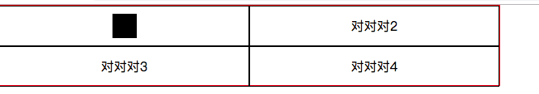

一直以来，都在使用flex布局。今天就来系统的写一下flex。
## flex
flex布局是Flexible Box的缩写，其意思是“弹性布局”。
不论是块级元素还是行内元素都可以使用flex布局。
```bash
# 块
.box {
    display: flex;
}
```
```bash
# 行内
.box {
    display: inline-flex;
}
```
### 属性
#### flex-direction属性
```bash
flex-direction: row|row-reverse|column|column-reverse|initial|inherit;
```
row: 水平显示，从左开始。
row-reverse：水平显示，从右开始。
column：垂直显示，从上开始。
column-reverse：垂直显示，从下开始。

#### flex-wrap属性
```bash
flex-wrap: nowrap|wrap|wrap-reverse|initial|inherit;
```
nowrap：（默认属性）不换行。

wrap：换行，在第一行上方。

wrap-reverse：换行，在第一行下方。

#### justify-content属性
```bash
justify-content: flex-start|flex-end|center|space-between|space-around|initial|inherit;
```
flex-start：（默认值）项目位于容器的开头。
flex-end：项目位于容器的结尾。
center：项目位于容器的中心。
space-between：项目位于各行之间留有空白的容器内。
space-around：项目位于各行之前、之间、之后都留有空白的容器内。

#### align-items属性
```bash
align-items: stretch|center|flex-start|flex-end|baseline|initial|inherit;
```
stretch：默认值。元素被拉伸以适应容器。
center：元素位于容器的中心。
flex-start：元素位于容器的开头。
flex-end：元素位于容器的结尾。
baseline：元素位于容器的基线上。

#### align-content属性
```bash
align-content: stretch|center|flex-start|flex-end|space-between|space-around|initial|inherit;
```
stretch：默认值。元素被拉伸以适应容器。
center：元素位于容器的中心。
flex-start：元素位于容器的开头。
flex-end：元素位于容器的结尾。
space-between：元素位于各行之间留有空白的容器内。
space-around：元素位于各行之前、之间、之后都留有空白的容器内。

### 课后题目
用flex布局实现

首先。。看到题目考虑到的是几个属性。flex-wrap、align-items、align-content。
实际来敲一下。
先来写一下html。
```bash
<div class="wrap">
    <div class="item">
        <div style="width: 30px; height: 30px; background: #000;"></div>
    </div>
    <div class="item">
        对对对2
    </div>
    <div class="item">
        对对对3
    </div>
    <div class="item">
        对对对4
    </div>
</div>
```
下面是css
```bash
.wrap {
    display: flex;
    border: 1px solid red;
    width: 620px;
    height: 100px;
    flex-wrap: wrap;
}
.item {
    display: flex;
    height: 50px;
    width: 50%;
    border: 1px solid #000;
    justify-content: center;
    align-items: center;
}
```
这样不论item里面是什么 都可以达到居中的效果。


