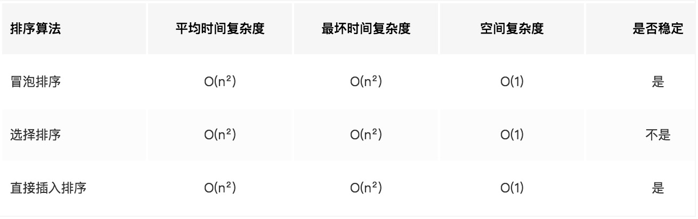

## 算法
  js在操作数组的时候，本身自己带有sort方法。这个方法基本已经满足了日常需求。但是今天还是来学习一下其他排序算法。先记录一下基本的排序算法。

### 冒泡排序
冒泡排序的思想很简单。就是前后两两比较大小。然后进行互换位置。
``` bash
    function sort(arr) {
        var len = arr.length;
        for (let i = 0 ; i < len; i++) {
            for(let j = 0; inner < len - i - 1; j++) {
                if(arr[j] > arr[j + 1]) {
                    [arr[j],arr[j+1]] = [arr[j+1],arr[j]];
                }
            }
        }
        return arr;
    }
```
以上使用ES6的解构赋值。进行交换位置
``` bash
    [arr[j],arr[j+1]] = [arr[j+1],arr[j]];
```
如果使用普通的方法就是以下内容
``` bash
    var swap = arr[j];
    arr[j] = arr[j+1];
    arr[j+1] = swap;
```

### 选择排序
选择排序是从数组的开头开始，将第一个元素和其他元素作比较，检查完所有的元素后，最小的放在第一个位置，接下来再开始从第二个元素开始，重复以上一直到最后。
``` bash
    function sort(arr) {
        var len = arr.length;
        for(let i = 0 ;i < len - 1; i++) {
            for(let j = i ; j < len; j++) {
                if(arr[j] < arr[i]) {
                    [arr[i],arr[j]] = [arr[j],arr[i]];
                }
            }
        }
        return arr
    }
```

### 插入排序
插入排序是随意拿出数组中的一个数，与第一张比较，如果比他小，就放在左边。然后继续拿出一个数。一次往里插入。
``` bash
    function sort(arr) {
        for(let i = 1; i < arr.length; i++) {  # 外循环从1开始，默认arr[0]是有序段
            for(let j = i; j > 0; j--) {  # j = i,将arr[j]依次插入有序段中
                if(arr[j] < arr[j-1]) {
                    [arr[j],arr[j-1]] = [arr[j-1],arr[j]];
                } else {
                    break; # 使用break是因为前面都是有序排序。如果当插入的值arr[j]大于或等于arr[j-1],就无法继续了，直接进入下一次循环即可。
                }
            }
        }
        return arr;
    }
```

时间复杂度。



