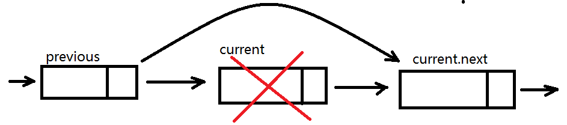
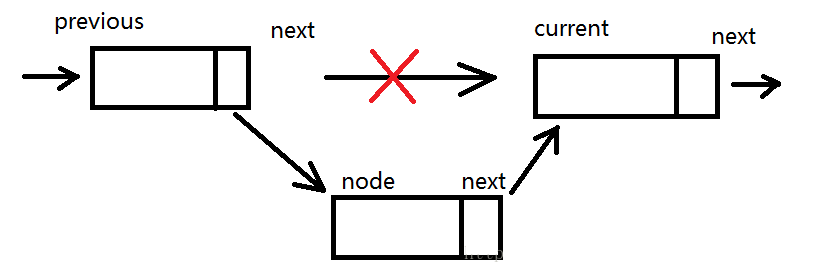

## 链表结构

之所以写这篇文章，是因为之前遇到过一个问题。正常我们要处理一个数组[1,3,4,5,6,7]这样一个数组。比如我们要插入一个值2，在当在前数组index等于1的位置上。第一反应会想到用splice();

### splice(index,howmany,item);
这个函数存在3个参数，其中index跟howmany为必填。
index:整数，规定添加/删除项目的位置，使用负数可从数组结尾处规定位置。
howmany:要删除的项目数量，如果设置为0，责不会删除项目。
item:唯一一个可选项，想数组添加新项目。

例如：
```bash
var arr = [1,3,4,5,6,7]
arr.splice(1,0,2);
console.log(arr); // [1,2,3,4,5,6,7];
```
翻阅了github [V8的源码660行](https://github.com/v8/v8/blob/ad82a40509c5b5b4680d4299c8f08d6c6d31af3c/src/js/array.js)
```bash
function ArraySplice(start, delete_count) {
  CHECK_OBJECT_COERCIBLE(this, "Array.prototype.splice");

  var num_arguments = arguments.length;
  var array = TO_OBJECT(this);
  var len = TO_LENGTH(array.length);
  var start_i = ComputeSpliceStartIndex(TO_INTEGER(start), len);
  var del_count = ComputeSpliceDeleteCount(delete_count, num_arguments, len,
                                           start_i);
  var deleted_elements = ArraySpeciesCreate(array, del_count);
  deleted_elements.length = del_count;
  var num_elements_to_add = num_arguments > 2 ? num_arguments - 2 : 0;

  if (del_count != num_elements_to_add && %object_is_sealed(array)) {
    throw %make_type_error(kArrayFunctionsOnSealed);
  } else if (del_count > 0 && %object_is_frozen(array)) {
    throw %make_type_error(kArrayFunctionsOnFrozen);
  }

  var changed_elements = del_count;
  if (num_elements_to_add != del_count) {
    // If the slice needs to do a actually move elements after the insertion
    // point, then include those in the estimate of changed elements.
    changed_elements += len - start_i - del_count;
  }
  if (UseSparseVariant(array, len, IS_ARRAY(array), changed_elements)) {
    %NormalizeElements(array);
    if (IS_ARRAY(deleted_elements)) %NormalizeElements(deleted_elements);
    SparseSlice(array, start_i, del_count, len, deleted_elements);
    SparseMove(array, start_i, del_count, len, num_elements_to_add);
  } else {
    SimpleSlice(array, start_i, del_count, len, deleted_elements);
    SimpleMove(array, start_i, del_count, len, num_elements_to_add);
  }

  // Insert the arguments into the resulting array in
  // place of the deleted elements.
  var i = start_i;
  var arguments_index = 2;
  var arguments_length = arguments.length;
  while (arguments_index < arguments_length) {
    array[i++] = arguments[arguments_index++];
  }
  array.length = len - del_count + num_elements_to_add;

  // Return the deleted elements.
  return deleted_elements;
}

```
====================

后话是，这么处理的速度是最优的么，用链表结构是不是好点。
那么 链表来了。。。
### 链表结构

链表特点：链表存储有序的元素集合，但不同于数组，链表中的元素在内存中并不是连续放置的。每个元素由一个存储元素本身的节点和一个指向下一个元素的引用（指针或链接）组成。

相对于传统的数组，链表的一个好处在于，添加或移除元素的时候不需要移动其他元素。然而，链表需要使用指针，因此实现链表时需要额外注意。数组的另一个细节是可以直接访问任何位置的元素，而想要访问链表中间的一个元素，需要从起点开始迭代链表直到找到所需元素。

用图来形容一下。


简单来解释一下，就是每一个节点都会对应有一个next，next指向到下一个节点。需要增加或者删除的时候只需要改变节点的next即可。
