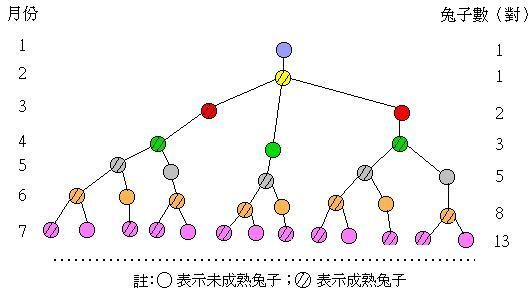

## 斐波那契数列

### 起源

公元1202年，意大利数学家斐波那契的传世之作《算法之术》出版。在这部名著中，斐波那契提出了以下饶有趣味的问题：

如果一开始有一对兔子，它们每月生育一对兔子，小兔在出生后一个月又开始生育且繁殖情况与最初的那对兔子一样，那么一年后有多少对兔子？



根据上图描述出来的结果就是：
1.第一个月初有一对刚诞生的兔子
2.第二个月之后（第三个月初）它们可以生育
3.每月每对可生育的兔子会诞生下一对新兔子
4.兔子永不死去

即可得出：


### 求解

斐波拉切数列常用的求解方式有两种，一种使用递归来求解。一种使用递推来求解。

1、 递归求解。
``` bash
	function fun(n) {
		if ( n < 2 ) {
			return 1
		}
		return fun(n-1)+fun(n-2)
	}
	#这是编程最方便的解法，当然，也是效率最低的解法，原因是会出现大量的重复计算。为了避免这种情况，可以采用递推的方式。
```
递归会降低性能，所以进行优化写法
``` bash
	let fun = (function () {
		let arr = [];
		return function(n) {
			if (arr[n] !== undefined) {
				return arr[n]
			}
		}
		return arr[n] = ( n === 0 || n === 1 ) ? n : fun(n-1) + fun(n-2)
	})()
	# 运用闭包原理。储存计算过的值在arr中。再下一次调用的时候去进行判断是否存在 不存在再进行计算。否则直接取出来对应的值
	# 也可以创建 {} 用键值对的key的唯一性去判断
```

2、递推求解。（循环）
``` bash
	function fun (n) {
		if ( n === 0 ) {
			return 0;
		}
		if ( n === 1 ) {
			return 1;
		}
		let a = 1, b = 2;
		for ( let i = 2; i < n.length; i++ ) {
			[a,b] = [a,a + b];
		}
		return b;
	}
```