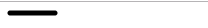
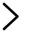
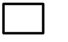
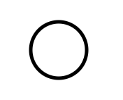
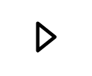
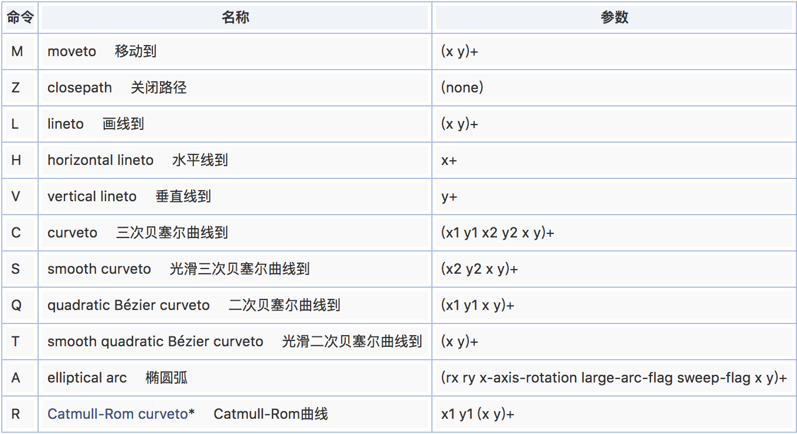

记得第一次接触svg的时候是14年，那时候做汽车类型的宣传网站。整个网站的设计图片很多，可能都不是很多能形容的，那可是相当的多。当时对图片进行了压缩处理。但是还是会有一些小的icon。所以当时会把图片用ai切出来。然后导出svg，查看一下代码。出现了一堆svg啊、path啊等等的标签。。。里面还有一堆数字。脑子混乱中。。

## 正文
可缩放矢量图形是基于可扩展标记语言（标准通用标记语言的子集），用于描述二维矢量图形的一种图形格式。它由万维网联盟制定，是一个开放标准。 --- 摘自百度百科

### 基本的svg元素
svg: 所有的svg图标存在于svg内部，这个标签是在html标签内的一个标签。类似于div这种。
line: 从字面意思上来理解，就是一条直线，用于创建一条直线。
polyline: 同上，创建一条折线。
rect: 创建矩形。
ellipse: 圆形或者椭圆形。
polygon: 多边形。
path: 通过点跟点绘制出来的路径创建各种图形。
defs: 定义一个可复用的图形。初始情况下defs里面的内容是不可见的。
g: 将多种图形组合在一起。
symbol: 类似于一个组合，但是拥有一些额外的特性。
use: 获取在defs中定义的复用对象并在 SVG 中显示出来。

### 绘制svg
在绘制之前呢。我想说的是。svg的绘制首先在脑子里形成一个网格图。或者围棋盘也好。分为x,y的坐标轴。x=0,y=0。这表即表示左上角的0,0点坐标。包括位移移动的位置,都是根据svg的0,0坐标进行计算的。

#### 设置基础的css样式
``` bash
svg {
  stroke: #000;  颜色
  stroke-width: 5; # 粗细5
  stroke-linecap: round; # 边角平滑
  stroke-linejoin: round; # 转角平滑
  fill: none; # 填充
}
```
#### 设置svg
``` bash
<svg width="500" height="500"></svg>
```
#### line
line元素存在4个属性

x1：起点的水平轴坐标
y1：起点的竖直轴坐标
x2：终点的水平轴坐标
y2：终点的竖直轴坐标

```bash
<line x1="3" y1="3" x2="48" y2="3"></line>
```

就像上方一样就可以绘制出一条直线。x1,y1为起始点。x2,y2为终点。

#### polyline
polyline只存在一个属性，那就是points。points内宝行所有线的点坐标。
```bash
<polyline points="3 3, 30 28, 3 53"></polyline>
```


#### rect
rect元素存在4个属性

x：左上角的x轴坐标值
y：左上角的y轴坐标值
width：矩形的宽度
height：矩形的高度
```bash
<rect x="3" y="3" width="80" height="60"></rect>
```


#### ellipse
ellipse元素存在4个属性
cx：中心位置在x轴上的坐标
cy：中心位置在y轴上的坐标
rx：沿x轴向的半径，也就是它会把图形分割成上下两部分
ry：沿y轴向的半径，也就是它会把图形分割成左右两部分
```bash
<ellipse cx="43" cy="43" rx="40" ry="40"></ellipse>
```


#### polygon
polygon只有一个属性points,值为各个点的坐标。
那我们来绘制一个三角形。
```bash
<polygon points="35 23, 60 43, 35 63" />
```

#### path
path有一个属性d。表示的是data。在data内去定义所有的点跟线。在这个属性里，设置路径点和在点之间创建连线的命令是由诸如 M 或 L 这样的单个字母来提供的，然后是一组 x 和/或 y 坐标。
```bash
<path d="
  M 18 3
  L 46 3
  L 46 40
  L 61 40
  L 32 68
  L 3 40
  L 18 40
  Z
"></path>
```

这是有上面path路径形成的图形。M表示移动到。L表示画线到。Z表示关闭路径。

#### defs与g
```bash
<defs>
    <g id="a">
        <ellipse cx="43" cy="43" rx="40" ry="40"></ellipse>
        <polygon points="35 23, 60 43, 35 63" />
    </g>
</defs>
<use href="#b" x="300" y="300"></use>
```
包含在defs内的元素不会显示出来。而g将ellipse跟polygon包成一体的。使用use去将defs内id为a的元素显示出来。use存在3个属性href、x、y，herf对应defs内的id。x,y则表示初始化的位置。

#### symbols
symbols与组合相似。但是他比组合多了一个属性viewBox。我们需要给 viewBox 属性4个值。前两个定义图标的左上角，第三和第四分别定义它的宽度和高度。
```bash
<symbol id="alert" viewBox="0 0 86 86">
    <ellipse cx="43" cy="43" rx="40" ry="40"></ellipse>
    <ellipse style="fill:black;" cx="43" cy="65" rx="5" ry="5"></ellipse>
    <line style="stroke-width: 8;" x1="43" y1="19" x2="43" y2="48"></line>
</symbol>
```
