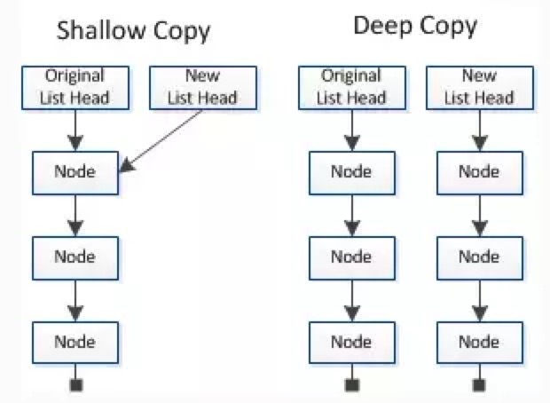
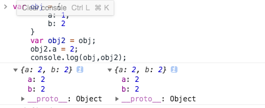
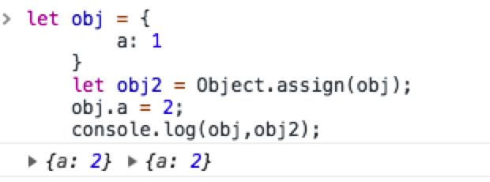
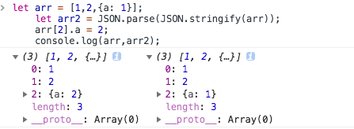
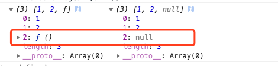
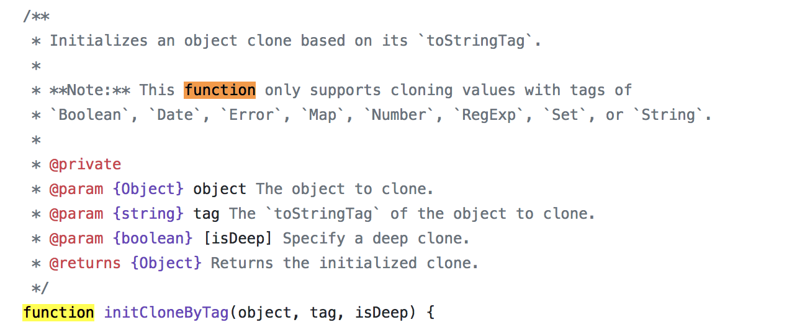
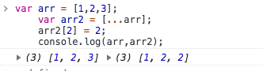

## 数据类型

数据分为基本数据类型(String, Number, boolean, Null, Undefined，Symbol)和对象数据类型。

* 基本数据类型的特点：直接存储在栈(stack)中的数据
* 对象数据类型的特点：存储的是该对象在栈中引用，真实的数据存放在堆内存里

## 深拷贝与浅拷贝

浅拷贝只复制指向某个对象的指针，而不复制对象本身，新旧对象还是共享同一块内存。但深拷贝会另外创造一个一模一样的对象，新对象跟原对象不共享内存，修改新对象不会改到原对象。

大概示意图入下


## 浅拷贝的实现方式
1、直接赋值给一个新的变量（这是我们日常工作中常用的）
```bash
    let obj = {
        a: 1,
        b: 2
    }
    let obj2 = obj;
    obj2.a = 2;
    console.log(obj,obj2);
```

2、Object.assign()
```bash
    let obj = {
        a: 1
    }
    let obj2 = Object.assign(obj);
    obj.a = 2;
    console.log(obj,obj2);
```

## 深拷贝的实现方式
1、JSON.parse(JSON.stringify())
日用工作中常用的方式。
```bash
    let arr = [1,2,{a: 1}];
    let arr2 = JSON.parse(JSON.stringify(arr));
    arr[2].a = 2;
    console.log(arr,arr2);
```

使用这种方式，我们只能处理标准的json格式的数据。但是不能处理函数，如果是函数则会返回null
```bash
    let arr = [1,2,function () {}];
    let arr2 = JSON.parse(JSON.stringify(arr));
    console.log(arr,arr2);
```

对于函数的处理目前还没有什么好的方式，目前只知道可以new一下可以进行深拷贝。
从lodash的源码里看到的也没有支持function类型。或者我没找对。。。

2、...运算符(一维数组)
```bash
    var arr = [1,2,3];
    var arr2 = [...arr];
    arr2[2] = 2;
    console.log(arr,arr2);
```


